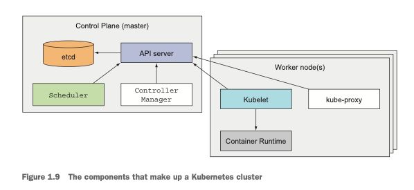
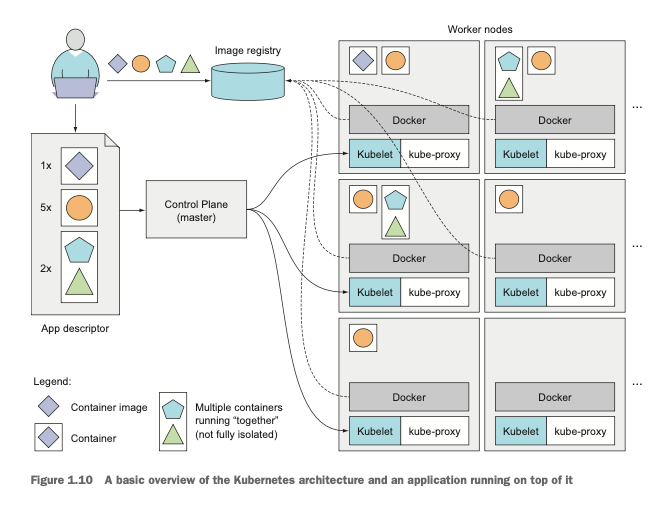

# 1. 쿠버네티스 소개

### 1.3.3 쿠버네티스 클러스터 아키텍처 이해

- 마스터 노드는 전체 쿠버네티스 시스템을 제어하고 관리하는 쿠버네티스 컨트롤 플레인을 실행한다.
- 워커 노드는 실제 배포되는 컨테이너 애플리케이션을 실행한다.

> 컨트롤 플레인 : 클러스터를 제어하고 작동시킨다. 
> 노드: 워커노드는 컨테이너화된 애플리케이션을 실행하는 시스템이다.

# 2. 도커와 쿠버네티스 첫걸음

# 3. Pods: 쿠버네티스에서 컨테이너 실행

