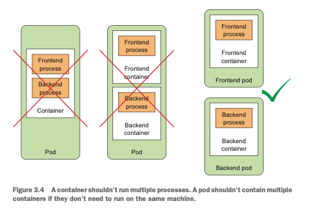

# 1. 쿠버네티스 소개

### 1.3.3 쿠버네티스 클러스터 아키텍처 이해

- 마스터 노드는 전체 쿠버네티스 시스템을 제어하고 관리하는 쿠버네티스 컨트롤 플레인을 실행한다.
- 워커 노드는 실제 배포되는 컨테이너 애플리케이션을 실행한다.


> 컨트롤 플레인 : 클러스터를 제어하고 작동시킨다.<br/>
> 노드: 워커노드는 컨테이너화된 애플리케이션을 실행하는 시스템이다.


# 2. 도커와 쿠버네티스 첫걸음
```shell
$ brew install minikube
```

# 3. Pods: 쿠버네티스에서 컨테이너 실행

## 3.1 Pods 소개

- 파드는 함께 배치된 컨테이너 그룹이며 쿠버네티스의 기본 빌딩 블록 (하나 이상의 컨테이너를 포함)
- 파드가 여러 컨테이너를 가지고 있을 경우, 항상 하나의 워커 노드에서 실행되며 여러 워커노드에 걸쳐 실행되지 않는다.


### 3.1.2 Pods 이해하기
- 모든 컨테이너는 같은 호스트 이름과 네트워크 인터페이스를 공유한다.
- 파드 안의 컨테이너는 동일한 IP주소와 포트를 공유한다.(동일한 파드 일경우 포트충돌 주의)
- 각 파드는 고유IP를 가지며, 모든 다른 파드에서 이 네트워크를 통해 접속할 수 있다. (플랫 네트워크)


### 3.1.3 파드에서 컨테이너의 적절한 구성
- 컨테이너는 여러 프로세스를 실행하지 말아야 한다.
- 파드는 동일한 머신에서 실행할 필요가 없다면 여러 컨테이너를 포함하지 말아야 한다.



# 4. 레플리케이션과 그 밖의 컨트롤러: 관리되는 파드 배포

